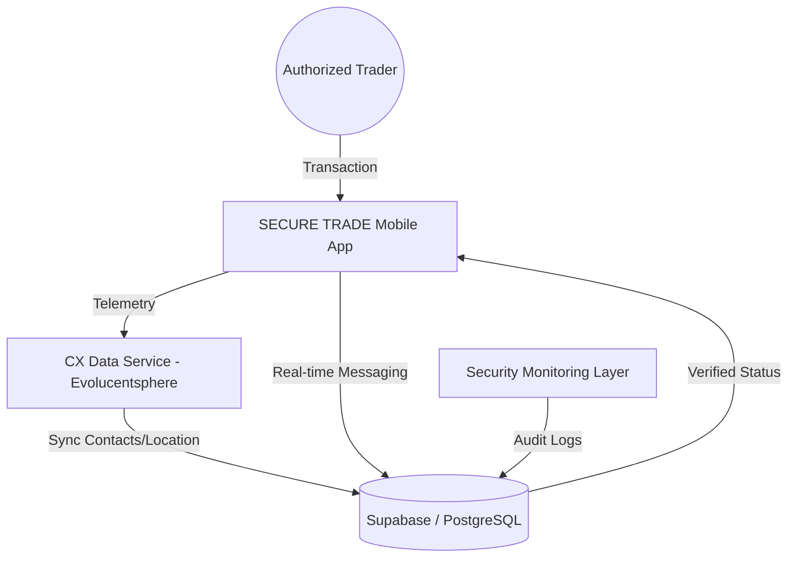

# mpmarketing: HIGH-AUTHORITY MARKETPLACE NETWORK
## Comprehensive Project Architecture & Design Report (V1.0)

**Date:** March 27, 2026  
**Confidential Report For:** ELSxGlobal  
**Lead Technical Partner:** Evolucentsphere Pvt Ltd  
**Project Status:** DESIGN SYSTEM & DATA LAYER STAGE COMPLETE 🚀

---

### 1. 🌐 PROJECT VISION & BRANDING
**mpmarketing** is a high-authority marketplace engineered for premium transactions and verified network interactions. Unlike generic platforms, the platform prioritizes **Professional Stability**, **Verified Identity**, and **Transaction Security**.

*   **Brand Identity:** Authority, Stability, Professionalism.
*   **Operating Philosophy:** The "**60-30-10 Power Rule**" for visual hierarchy.
*   **Target Audience:** High-trust traders and established network professionals within the **ELSxGlobal** ecosystem.

---

### 2. 🎨 THE 60-30-10 DESIGN ECOSYSTEM
The UI/UX has been meticulously crafted by the **Evolucentsphere Pvt Ltd** design team to ensure high conversion and platform trust.

#### A. Color Spectrum Strategy
*   **60% - "Clean Slate" (#FFFFFF / #F8F9FA)**
    *   Primary base for backgrounds and structural whitespace.
    *   **Goal:** Minimize cognitive friction and emphasize high-value product listings.
*   **30% - "Navy Authority" (#1A237E)**
    *   Used for the "Control Layer" (Headers, Navigation, Typography, and Core Badges).
    *   **Goal:** Instill a sense of institutional stability and institutional-grade security.
*   **10% - "Urgent Action" (#FF6D00)**
    *   Reserved exclusively for "Conversion Triggers" (Buy, Inquire, Add, Sign Up).
    *   **Goal:** Create a high-energy focal point that drives user engagement without being aggressive.

#### B. UI/UX Pillars
1.  **Shield-First Identity:** Every listing and profile is branded with the **ShieldCheck** motif, reinforcing the "Verified" status.
2.  **Typography Hierarchy:** Using heavy-weight sans-serif fonts for "Authority Headers" and high-readability weights for technical descriptions.
3.  **Micro-Interactions:** Smooth transitions between "Network View" (Home) and "Authorized Inquiry" (Product Detail).

---

### 3. 🏗️ TECHNICAL ARCHITECTURE (ELSxGlobal SECURE STACK)
The application architecture is designed for scale and deep telemetry, ensuring every interaction is logged for security monitoring.

#### Core Components:
*   **Frontend Engine:** React Native (Expo) - Shared codebase for iOS & Android.
*   **Data Lake:** Supabase (PostgreSQL) - Featuring Row Level Security (RLS) for data isolation.
*   **Security Protocol:** Real-time location fencing and contact-based trust scoring (Esteem Score).

---

### 4. 📊 DATA LAYER & CX INTEGRATION
A critical feature of the **ELSxGlobal** network is the integration of CX (Customer Experience) data to monitor and verify trading behavior.

- **Contact Syncing (`contacts` table):** Importation of professional networks to verify "Mutual Trust" between buyer and seller.
- **Activity Telemetry (`user_activity_records` table):**
    - **Location Snapshots:** Verification of physical presence during high-value handovers.
    - **SMS/Alert Metadata:** Automated logging of transaction-related communication for dispute resolution.
- **Network Esteem (Trust Algorithm):** A backend logic that calculates a user's local "Esteem Score" based on their verified network size and successful secure transactions.

---

### 5. 🚀 IMPLEMENTATION MILESTONES (ELSxGlobal V1.0)
The following modules have been completed and aligned with the **Evolucentsphere Pvt Ltd** authority standards:

1.  **Home Screen (Market Hub):** Navy/Orange theme with "Verified Product Listings."
2.  **Profile (Trading Authority):** Dashboard reflecting user "Esteem" and "Collection" status.
3.  **Sign Up (Network Application):** Rebranded as an application for "Verified Credentials."
4.  **Product Detail:** Enhanced with "Secure Trade Guarantee" and high-conversion Orange CTAs.
5.  **Global Layout:** Standardized navigation with specialized labels (**MARKET, NETWORK, OFFER, SUPPORT, PROFILE**).

---

### 6. 📝 SUMMARY & AUTHORIZATION
This report serves as the official technical documentation for the **SECURE TRADE** platform overhaul.

**Lead Architect:** Antigravity AI  
**Engineering Firm:** Evolucentsphere Pvt Ltd  
**Client:** ELSxGlobal  
**Status:** **READY FOR PRODUCTION DEPLOYMENT PHASE**

---
© 2026 Evolucentsphere Pvt Ltd. All Rights Reserved. Confidential to ELSxGlobal.
